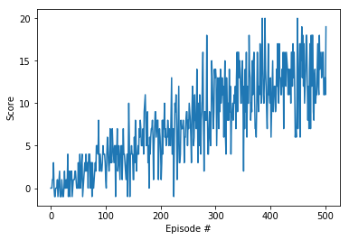

The goal of this project is to an agent to navigate a unity environment collecting yellow bananas, the envornment consists of 37 continous state spaces, the agent gets a reward of +1 for a yellow banana collected and -1 for a blue banana. There are 4 actions to choose from: move left, move right, move forward and move backward.


```python
from unityagents import UnityEnvironment
import numpy as np
env = UnityEnvironment(file_name="/data/Banana_Linux_NoVis/Banana.x86_64")
```

    INFO:unityagents:
    'Academy' started successfully!
    Unity Academy name: Academy
            Number of Brains: 1
            Number of External Brains : 1
            Lesson number : 0
            Reset Parameters :
    		
    Unity brain name: BananaBrain
            Number of Visual Observations (per agent): 0
            Vector Observation space type: continuous
            Vector Observation space size (per agent): 37
            Number of stacked Vector Observation: 1
            Vector Action space type: discrete
            Vector Action space size (per agent): 4
            Vector Action descriptions: , , , 


Environments contain **_brains_** which are responsible for deciding the actions of their associated agents. Here we check for the first brain available, and set it as the default brain we will be controlling from Python.


```python
# get the default brain
brain_name = env.brain_names[0]
brain = env.brains[brain_name]
```

### 2. Examine the State and Action Spaces

Run the code cell below to print some information about the environment.


```python
# reset the environment
env_info = env.reset(train_mode=True)[brain_name]

# number of agents in the environment
print('Number of agents:', len(env_info.agents))

# number of actions
action_size = brain.vector_action_space_size
print('Number of actions:', action_size)

# examine the state space 
state = env_info.vector_observations[0]
print('States look like:', state)
state_size = len(state)
print('States have length:', state_size)
```

    Number of agents: 1
    Number of actions: 4
    States look like: [ 0.          1.          0.          0.          0.16895212  0.          1.
      0.          0.          0.20073597  1.          0.          0.          0.
      0.12865657  0.          1.          0.          0.          0.14938059
      1.          0.          0.          0.          0.58185619  0.          1.
      0.          0.          0.16089135  0.          1.          0.          0.
      0.31775284  0.          0.        ]
    States have length: 37

### Model Architecture

The model consists of 3 fully connected layers
The first layer takes in the state size which in this case is 37 and passes this to the hidden layer and outputs the action size

The relu activation function is applied and no activation is applied on the output layer

Finally we return the output of the last fully connected layer

### Hyperparameters used


```python
n_episodes = 1000 # Number of episodes
max_t = 2000 # Number of timesteps per episode
eps_start = 1.0 # Epsilon start
eps_end = 0.1 # Epsilon end
eps_decay = 0.995 # Epsilon decay
```


```python
scores = dqn(n_episodes, max_t, eps_start, eps_end, eps_decay)
```

    Episode 100 	Average score:  1.50
    Episode 200 	Average score:  4.76
    Episode 300 	Average score:  7.53
    Episode 400 	Average score:  11.25
    Episode 500 	Average score:  12.91
    Episode 502 	Average score:  13.02
    Environment solved in  402 episodes!	Average Score:  13.02


As seen the agent is able to solve the environment after 402 episodes


```python
fig = plt.figure()
ax = fig.add_subplot(111)
plt.plot(np.arange(len(scores)), scores)
plt.ylabel('Score')
plt.xlabel('Episode #')
plt.show()
```





```python
env_info = env.reset(train_mode=False)[brain_name] # reset the environment
state = env_info.vector_observations[0]            # get the current state
score = 0                                          # initialize the score
while True:
    action = agent.act(state)                      # select an action
    env_info = env.step(action)[brain_name]        # send the action to the environment
    next_state = env_info.vector_observations[0]   # get the next state
    reward = env_info.rewards[0]                   # get the reward
    done = env_info.local_done[0]                  # see if episode has finished
    score += reward                                # update the score
    state = next_state                             # roll over the state to next time step
    if done:                                       # exit loop if episode finished
        break
    
print("Score: {}".format(score))
```

    Score: 16.0


In conclusion this can be improved by testing other implementions such Double DQN and Dueling DQN 

Hyperparameter search should also lead to better performance
